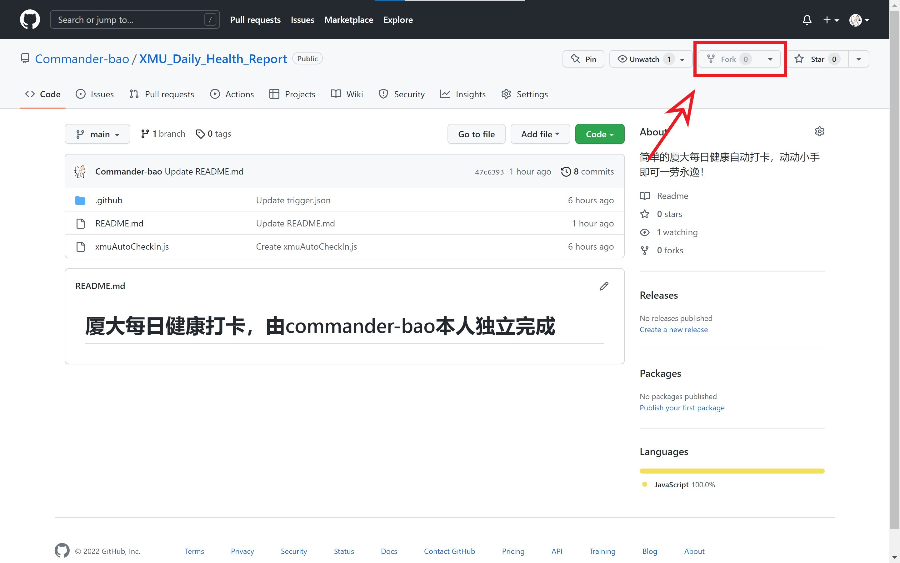
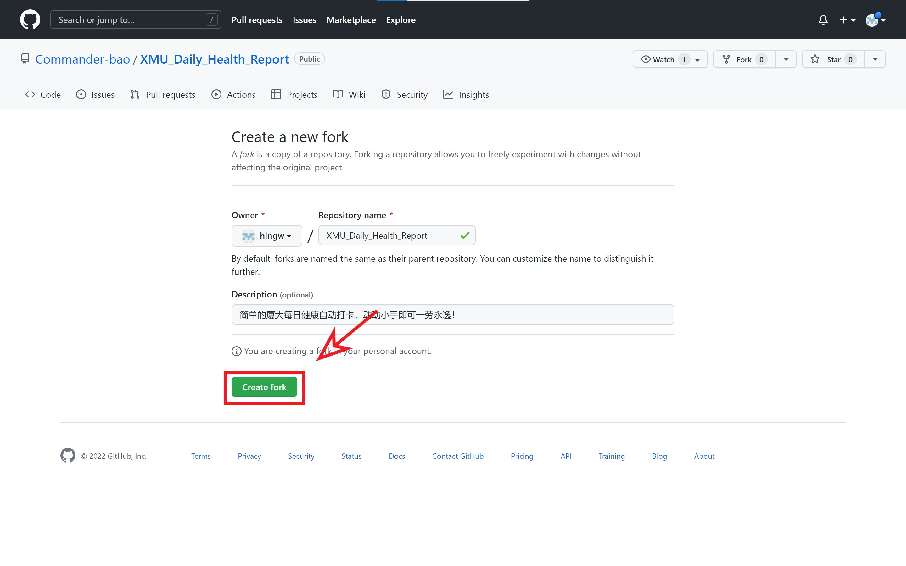
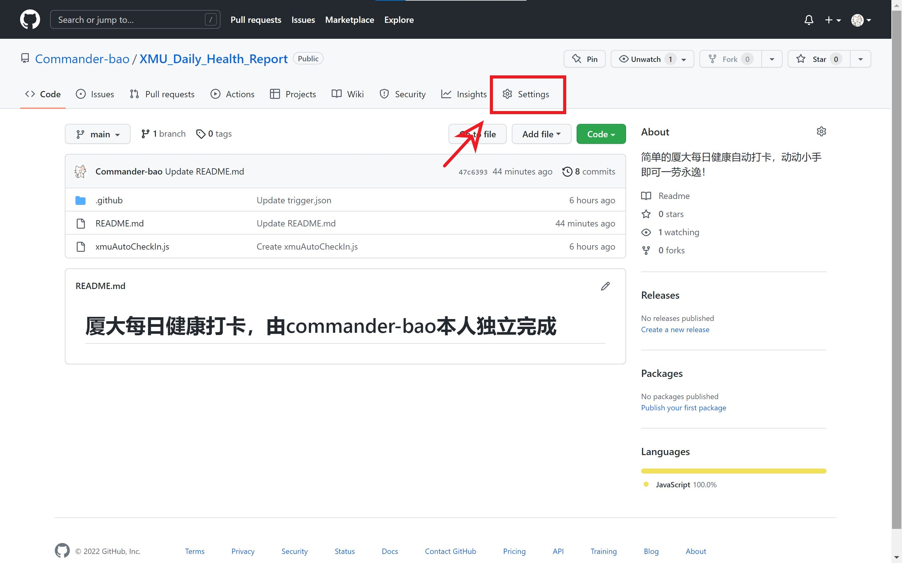
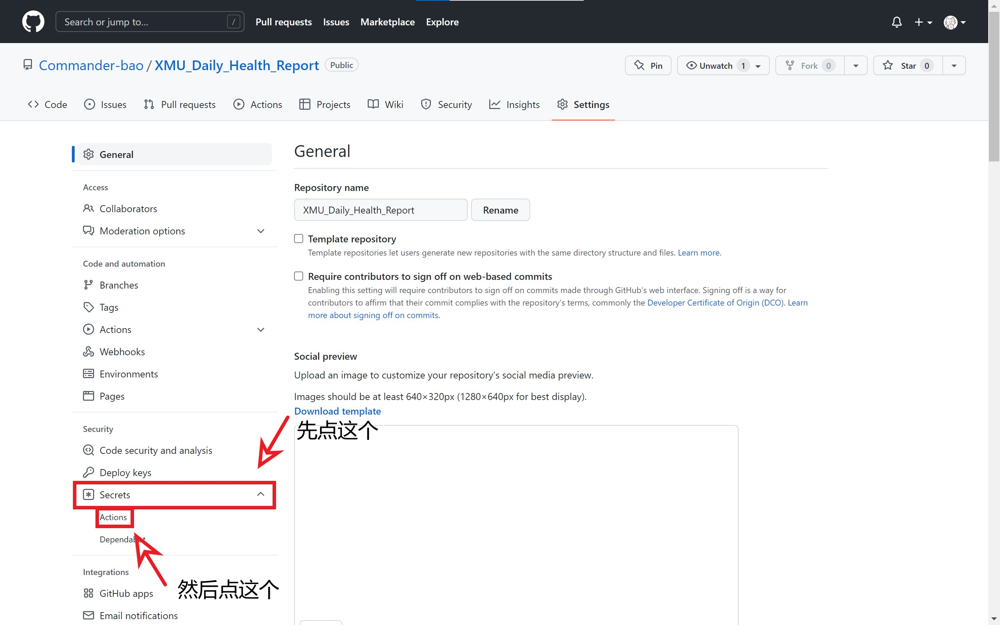
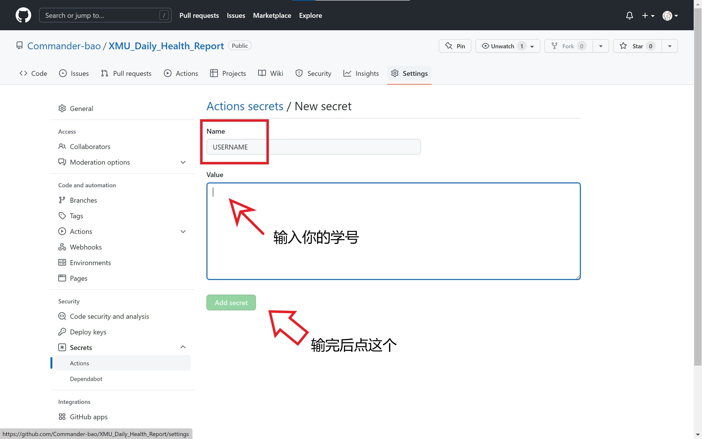
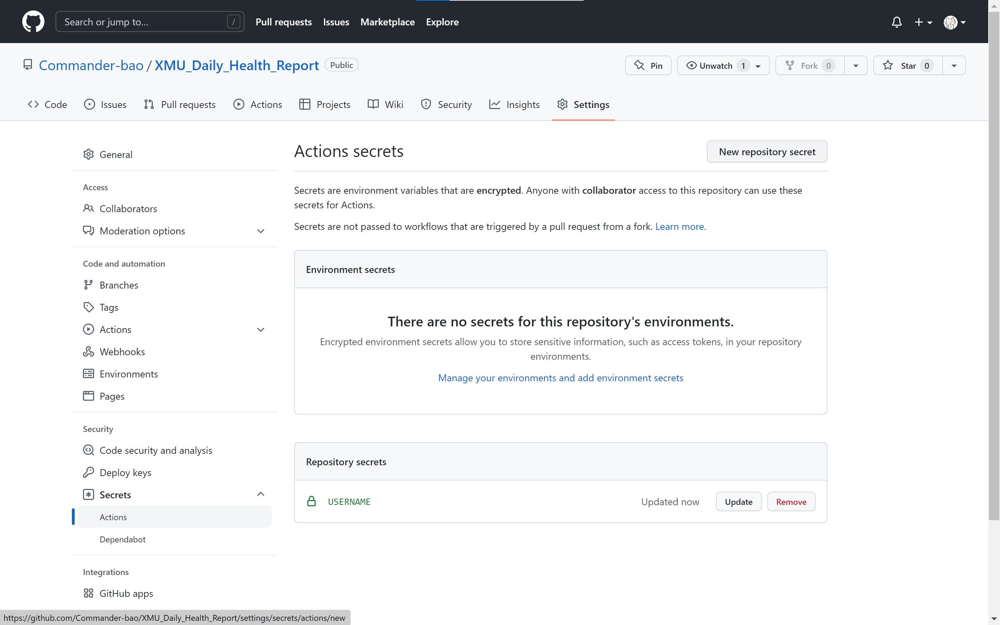
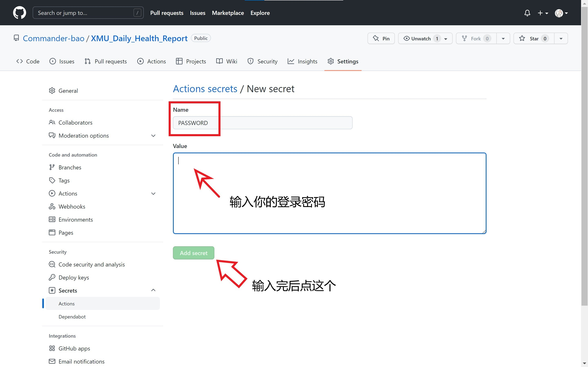
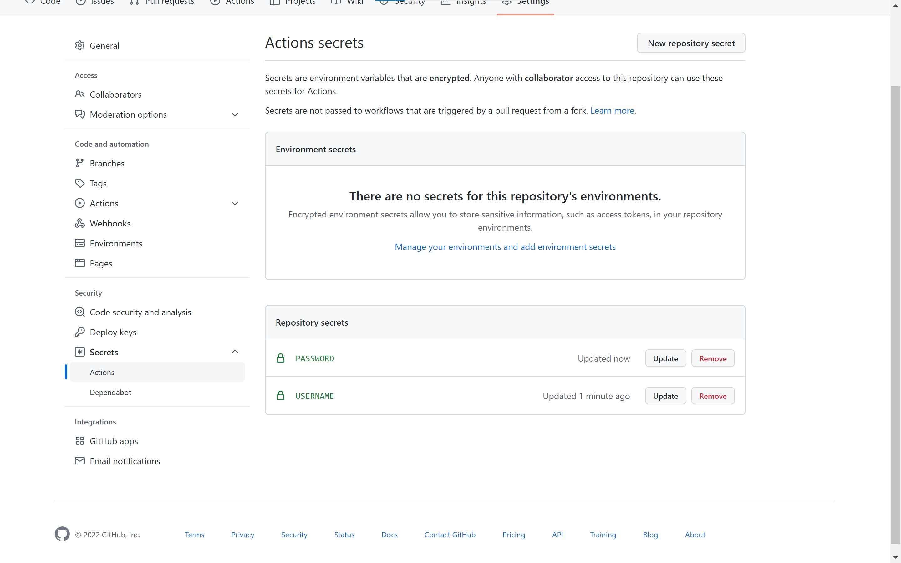

# 厦大每日健康打卡，由commander-bao本人独立完成

## 免责声明

### 如果您配置了此项目，请于测试后删除，作为xmu学子，为防疫安全，必须坚持每日手动打卡

本项目的开发者完全出于以下目的而进行开发：

1. 学习、熟悉JavaScriopt，学习、练习使用puppeteer的爬虫技术
2. 学习完整的开源项目流程，包括开发、测试、维护等
3. 掌握 GitHub Actions 等相关知识

本项目承诺：

1. 该项目的所有代码、文档、示例等均是以学习全过程软件开发与学习交流为目的，所有开发者除了必要的功能测试以外，没有在任何时间下使用过这个项目。
2. 该项目父仓库的所有 Actions 均采用了测试用配置，仅仅用于监控软件状态以确认维护工作的任务，没有真正用于打卡。
3. 本项目不会保存您的所有个人信息，不必担心隐私泄露。

## 如果要测试使用本打卡系统，下面是配置教程

### 首先，点击Fork

### 然后，点击Create fork

### fork成功之后，你就有了一个自己的仓库啦，点击Settings

### 跳转后，点击secrets，随后点击下拉框中的Actions

### 随后点击New repository secret

### 首先在name栏里输入USERNAME，大写的，和我的一样，然后在value里输入你的学号，纯数字，完成后点击Add secret

### 这时你发现USERNAME已经配置好了，再点击New repository secret

### 然后在name栏里输入PASSWORD，大写的，和我的一样，然后再value里输入你的登录密码，是什么就输入什么，别多加一个符号，随后点击Add secret

### 这时如果你显示的和我一样，证明你配置成功了！

