# 厦大每日健康打卡，由commander-bao本人独立完成
提示：请认真阅读以下文档。如果发现图片无法加载，需要挂上梯子哦，想测试成功记得允许Actions
视频教程网址 https://v.youku.com/v_show/id_XNTg5MTQ0MjMyNA==.html 密码 xmuHealth
## version 1.2.2 修复了运行时卡住无法退出的bug
## 历史版本
#### version 1.2.1 修复了打卡时间是格林威治时间的bug
#### version 1.2.0 增加了发送邮件的功能
#### version 1.1.0 增加了随机时间打卡的功能
#### version 1.0.0 实现了每日自动打卡的功能

## 免责声明

### 如果您配置了此项目，请于测试后删除，作为xmu学子，为防疫安全，必须坚持每日手动打卡

本项目的开发者完全出于以下目的而进行开发：

1. 学习、熟悉JavaScriopt，学习、练习使用puppeteer的爬虫技术
2. 学习完整的开源项目流程，包括开发、测试、维护等
3. 掌握 GitHub Actions 等相关知识

本项目承诺：

1. 该项目的所有代码、文档、示例等均是以学习全过程软件开发与学习交流为目的，所有开发者除了必要的功能测试以外，没有在任何时间下使用过这个项目。
2. 该项目仓库的 Actions 均采用了测试用配置，仅仅用于监控软件状态以确认维护工作的任务，没有真正用于打卡。
3. 本项目不会也无法保存您的所有个人信息，个人信息都保存在您本地且加密，不必担心隐私泄露。

## 如果要测试使用本打卡系统，下面是配置教程

### 首先，点击Fork

### 然后，点击Create fork

### fork成功之后，你就有了一个自己的仓库啦，点击Settings

### 跳转后，点击secrets，随后点击下拉框中的Actions

### 随后点击New repository secret

### 首先在name栏里输入USERNAME，大写的，和我的一样，然后在value里输入你的学号，纯数字，完成后点击Add secret

### 这时你发现USERNAME已经配置好了，再点击New repository secret

### 然后在name栏里输入PASSWORD，大写的，和我的一样，然后在value里输入你的登录密码，是什么就输入什么，别多加一个符号，随后点击Add secret

### 最后在name栏里输入EMAIL，大写的，然后在value里输入你的邮箱，要求如上，随后点击Add secret
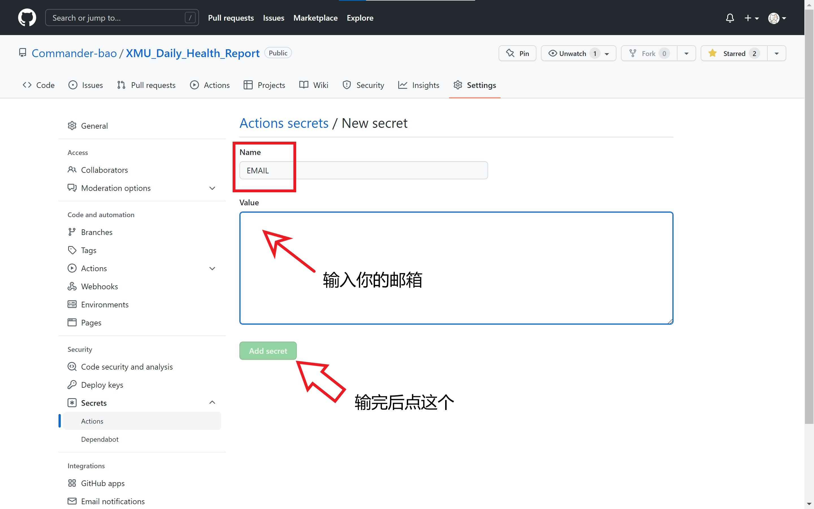
### 这时如果你显示的和我一样，证明你配置成功了！

### 完成后，每天早上六点会自己运行，如需另外测试，请点击Actions

### 而后点击AutoCheckIn.js
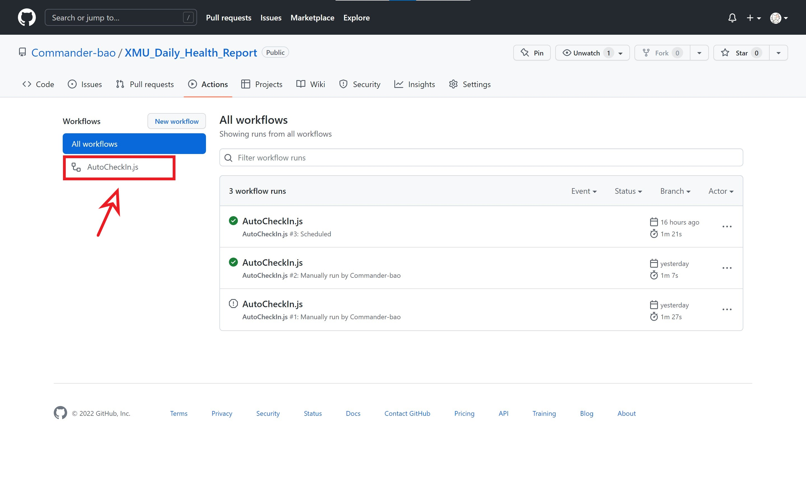
### 点击Run workflow
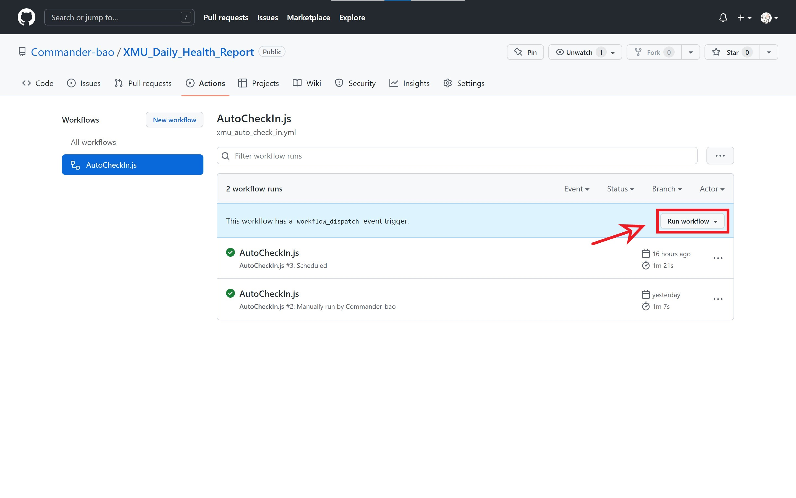
### 再点击Run workflow
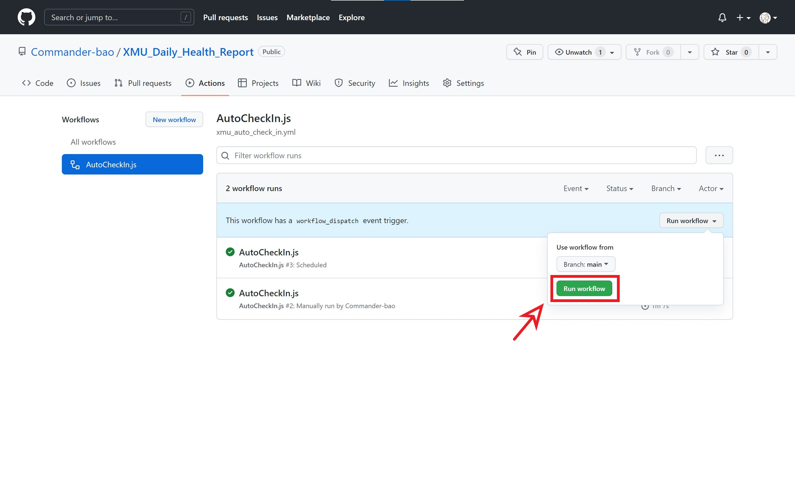
### 刷新一下，点击去就能看到运行过程了

## 如果想在本地配置puppeteer，下面是教程
### 首先进入nodejs的官网 https://nodejs.org/en/
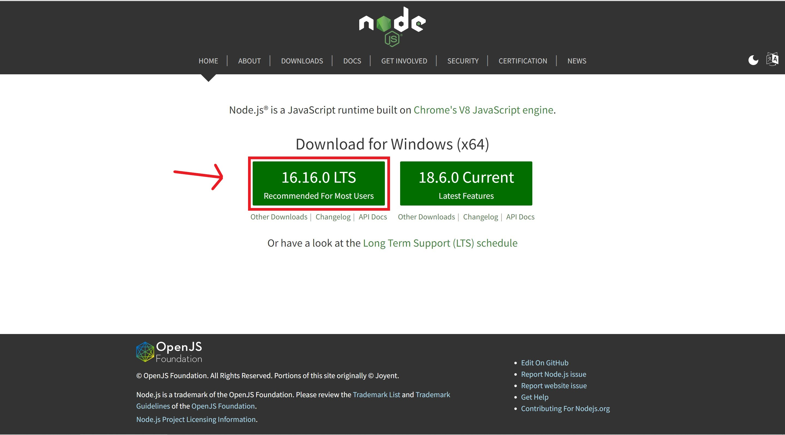
### 点击下载，这里我没有选最新版本，看个人
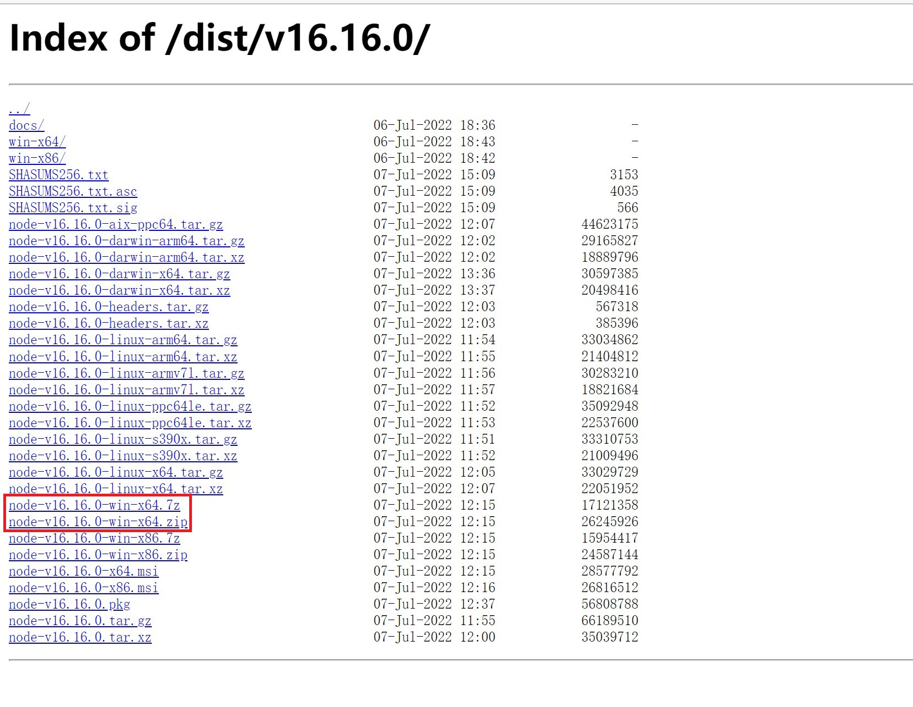
### Windows 64位机下载x64.smi文件
### 下载完后找个文件夹安装，一路next就行，它会自动添加path路径

### 安装完的样子
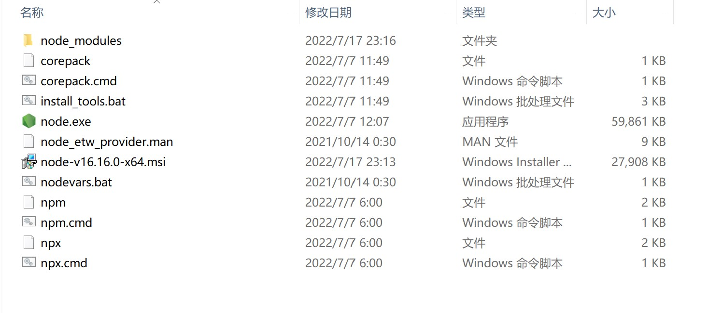
### 开个终端看看npm是不是安装成功了
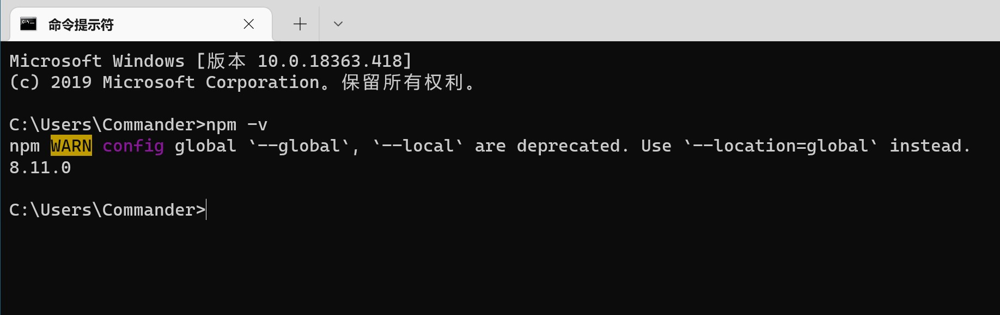
### 成功之后建个文件夹，我命名成了puppeteer
### 然后输入npm init，一路回车就行
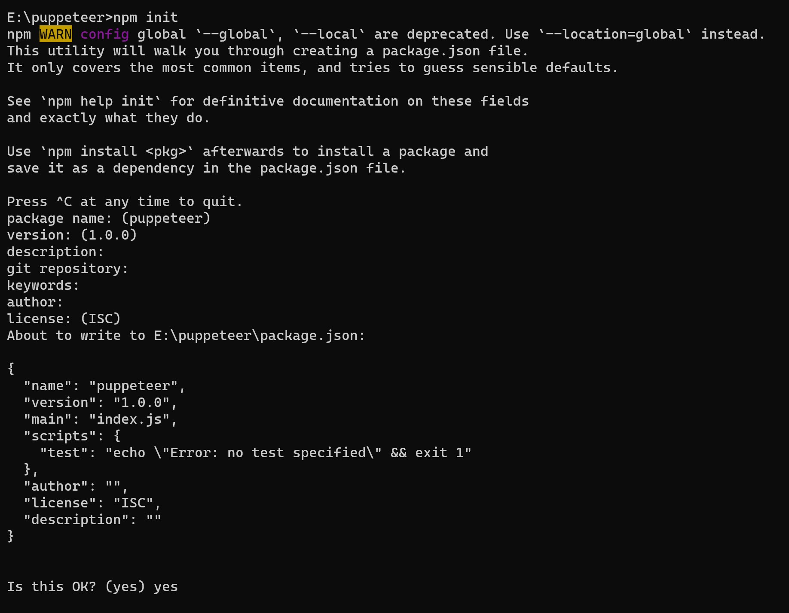
### 再输入npm install puppeteer，回车
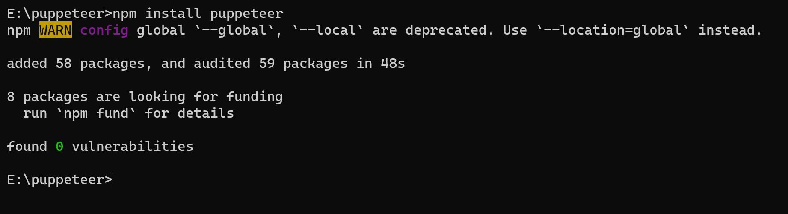
### 到此puppeteer安装完成
### 由于新增了发送邮件的功能，需要再安装一个nodemailer模块
### 在之前的基础上输入npm install nodemailer --save
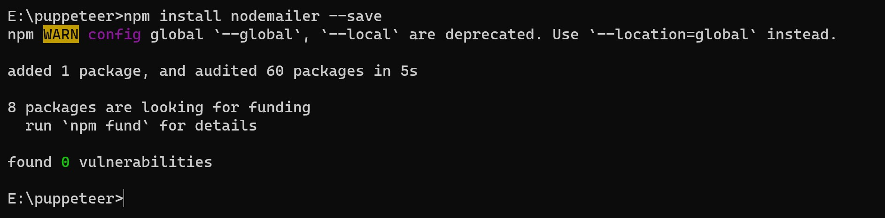
### 最后，把我的xmuAutoCheckIn.js文件放进这个文件夹,用vscode就能运行了

## 树莓派安装 https://zhuanlan.zhihu.com/p/127757097
### 温馨提示：树莓派需要使用最新的64位操作系统才能运行
